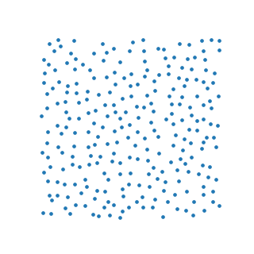

<div align="center">

# YDP-MD Engine
</div>
</br>

This is a Molecular Dynamics Simulator to simulate Dusty Plasma. It contains "N" charged particles interacting with each other using screened coulumb a.k.a Yukawa Potential Energy.

This repository contains 4 main python files:

### 1. imports.py

This file holds all the libraries and the function from other .py files to be imported for use in other files, some imports may be circular. This helps us by reducing the headspace used to separately import libraries and files for every single file since most libraries are reused.

Instead of writing:

```
from __future__ import annotations
import argparse
import os
import numpy as np
import matplotlib.pyplot as plt
import importlib
```

just write:

```
from imports import *
```

### 2. sim.py

This file contains all the physics functions, to compute the Winger-Seitz Radius, Initialize positions and velocities, apply the Langevin thermostat, calculate the radial distribution function, compute the interaction potential energy and force and finally, dynamize the simulation, i.e computing the final positions after the interaction between particles in the 'dt' time interval which is arbitrary.

The box length is computer using the Winger Seitz Radius: `L = sqrt(pi * N)` where N is the total number of particles

The positions are intialized as a slightly jittered triangular lattice ( jitter is of 1e-1 order), so that it doesn't start as a solid but somewhere close to it. For that, we start all even rows at column 0 and every odd row at column 0.5 and after the triangular lattice has been initialized, a jitter of 0.3 is applied, this way each particle is randomly moved by a certain amount with a 0.3 multiplier.

<br>



*Figure: A visual phase diagram, straight out of the simulator. Coupling Γ increases left → right (hot → cold), screening κ increases top → bottom. Watch the hot liquid freeze into a triangular crystal — and look closely at the bottom-right panel: at κ = 3 the melting line has climbed to Γ_m ≈ 1100, so Γ = 1200 is only barely solid and full of defects. The physics is in the pictures.*

*This is an example of a snapshot generated by the simulator*

> *"This single file is meant to be READ as much as RUN."*`sim.py`, line 1

### 3. test.py

This file has a validation ladder checking multiple parameters of the run. These parameters are affected by the manually controlled variables like Number of particles, coupling parameter, screening parameter, friction, etc. If these parameters are in the designated range, then the output will not be faulty, else the positions.npy file it produces is unreliable

More details about the validation ladder is in the upcoming sections

### 4. run.py

This file mainly holds everything that the user will interact with, run commands, CLI outputs and making the output data directory

## Install and Run

```
git clone https://github.com/KushmanG/Yukawa-Dusty-Plasma-Molecular-Dynamics-Engine.git
cd Yukawa-Dusty-Plasma-Molecular-Dynamics-Engine
python3 -m venv md && source md/bin/activate
pip install -r requirements.txt
```

```
python3 test.py                # run the 5-gate validation ladder
python3 run.py --pilot         # pilot dataset 
python3 run.py                 # full dataset
```

| run.py flag       | What it does                                          | When to use it                                                         |
| ----------------- | ----------------------------------------------------- | ---------------------------------------------------------------------- |
| --skip-validation | Creates a dataset without using the validation ladder | Arbitrary                                                              |
| --pilot           | Runs validation and returns a small 3x3x3 dataset     | Just to check if the pipeline works/to test the CNN on a small dataset |

Things I need to talk about:

1. Validation Ladder

## The Validation Ladder

`run.py` **refuses to generate data** until every gate in `test.py` passes. The five gates, with currently measured values:

| # | Gate                               | Criterion                     | Measured         | Status |
| - | ---------------------------------- | ----------------------------- | ---------------- | ------ |
| 1 | Newton's 3rd law                   | \|ΣF\| < 10⁻¹⁰            | ~2.5 × 10⁻¹⁴ | PASS   |
| 2 | NVE energy conservation            | rel. drift < 10⁻²           | 9.2 × 10⁻⁵    | PASS   |
| 3 | Thermostat convergence             | \|T̄ − T_target\| < 5%      | +1.6%            | PASS   |
| 4 | g(r) normalization (ideal gas)     | \|ḡ − 1\| < 0.05            | 0.005            | PASS   |
| 5 | g(r) structure (crystal vs liquid) | peak > 2.5 and > 1.5× liquid | 3.30 vs 1.01     | PASS   |

None of the thresholds above are guesses. Each one was pinned by a **calibration study** (`heuristics.py`, ~50 full simulations, fixed seeds, fully reproducible via `python3 heuristics.py --all`) using only standard, citable methods:

| Sweep                  | Standard method                                  | What it pinned                                          |
| ---------------------- | ------------------------------------------------ | ------------------------------------------------------- |
| S1 timestep            | NVE drift vs dt on log-log (must scale as dt²)  | dt = 0.01 with 131× headroom below the drift bound     |
| S2 equilibration       | settling time of T(t) and U(t), 8 seeds          | averaging cutoff (2000 steps), run length (6000)        |
| S3 decorrelation       | velocity & energy autocorrelation, integrated τ | frame-sampling interval, honestly reframed (see below)  |
| S4 g(r) resolution     | convergence ("knee") study, like mesh refinement | frames = 50, bins = 80 (bins < 60 under-resolves)       |
| S5 noise floors        | 10 seed replicas + Flyvbjerg–Petersen blocking  | the 5% and 0.05 tolerances (4.4× and 70× above noise) |
| S6 peak separation     | 10-seed distributions of crystal/liquid peaks    | thresholds sit inside a gap ~17σ wide — no overlap    |
| S7 bin skipping        | per-bin Poisson noise + verdict sensitivity      | skip = 5 small-r bins (verdict flat over skip 0–12)    |
| S8 friction invariance | equilibrium observables vs Langevin friction     | friction = 1.0 (usable window [0.5, 2])                 |

<p align="center">


</p>

The calibration even **caught two of the suite's own assumptions being wrong**: the original 1000-step averaging cutoff started inside the cooling transient (fixed → 2000), and the frame-sampling interval turned out not to give independent frames (reframed as thinning; independence comes from seed replicas instead). A validation suite that can catch its own assumptions is one you can trust. Full report with every number: [`testing_parameters.txt`](testing_parameters.txt) · raw evidence: [`heuristics_out/`](heuristics_out/).

## The Dataset

After the validation ladder, `run.py` produces the dataset in the following format:

```
data/
├── manifest.csv     
├── sample_0000/
│   ├── positions.npy       
│   ├── metadata.npy   
│   └── snapshot.png      
├── sample_0001/
└── ...
```

1. positions.npy is a (N,2) `ndarray` containing coordinates of all particles. This file is unloaded and rasterized for ingestion of CNNs
2. metadata.npy is an ndarray containing only the number of particles and the true gamma and kappa values as the reference values for the CNN
3. snapshot.png is just a snapshot of all the particles plotted using matplotlib, this is generated directly using the simulator so it will be correct, it can be used to check if the rasterizer is functioning perfectly in any CNN program

**Data Grid:** Log-spaced Γ values × Linear κ values × Independent seed per Γ-κ  pair

For our major dataset we have chosen:

- 10 log-spaced Γ values in the range [ 2, 1200 ]
- 10 linearly-spaced κ values in the range [ 1, 3 ]
- 20 seeds per Γ-κ  pair

So we have 2000 datapoints.

## The Physics

It models dust grains suspended in a plasma. In the lab these are heavy grains floating in an ionized gas, the surrounding electrons and ions screen each grain's charge. The code simulates N such grains as point particles in a 2D box and lets them push on each other and move under Newton's laws.

### The Interaction between particles

A bare charge in vacuum has a Coulomb potential U ∝ 1/r. But in a plasma, mobile electrons and ions cluster around each grain and **shield** its field, so the potential falls off much faster. That's the Yukawa form the code uses.

$$
U(r) = \frac{e^{-\kappa r}}{r}, \qquad F(r) = \frac{dU}{dr} = \frac{(\kappa r + 1)e^{-\kappa r}}{r^{2}}
$$

The exponential factor represents the screening, without it you'd have plain Coulomb. The force is purely repulsive and points along the line joining the two particles. In the `net_force()` function, we use the vector form of this force by multiplying the scalar form of force with the unit vector along the line joining the two particles. Thus:

$$
\vec{F}_{ij} = \frac{(\kappa r_{ij} + 1)\,e^{-\kappa r_{ij}}}{r_{ij}^{\,3}}\;\vec{r}_{ij}, \qquad \vec{F}_i = \sum_{j \neq i} \vec{F}_{ij}
$$

### Reduced units

To avoid carrying SI constants, everything is normalized: mass m = 1, energy scale ε = 1, Boltzmann constant = 1, and the length scale is the **Wigner–Seitz radius** a = 1. Because m = 1, Newton's law F = ma just becomes **a = F**

### Density and box size

In 2D the Wigner–Seitz radius is defined so each particle "owns" a disk of radius a, n is the number density. With a = 1, the area per particle is exactly π, so the total area is Nπ and the box side is fixed:

$$
n = \frac{N}{L^2}, \qquad \pi a^2 = \frac{1}{n}, \qquad
\boxed{L = \sqrt{N\pi}} \quad (a = 1)
$$

### Periodic boundaries + minimum image convention

The box is a small window onto a much larger plasma, so it uses periodic boundary conditions, i.e a particle exiting the right edge re-enters on the left, the box tiles space. The walls are fictitious, not real barriers.

The minimum image convention is the companion rule for forces, each particle interacts with the nearest copy of every other particle across the periodic tiling. Implemented as:

```
disp -= L * np.round(disp / L)

```

This wraps every pairwise displacement into the range [−L/2, L/2], picking the shortest image. Without it the forces would be wrong (the comment notes an earlier version was buggy for exactly this reason).

### Initial conditions

**Positions** (`initial_positions`):

Particles are seeded on a triangular (hexagonal) lattice, with row spacing scaled by √3/2 and alternate rows offset by half a                       spacing. A small Gaussian **jitter** is added so the system isn't sitting in a perfect (and unphysical) energy minimum.

**Velocities** (`initial_velocities`):

Drawn from a **Maxwell–Boltzmann distribution**, which for each component is a Gaussian with standard deviation √T (since m = 1, k\_B = 1). Two corrections follow: subtracting the mean velocity removes any **net drift** of the whole system (no spurious center-of-mass motion), and rescaling by √(T/T\_measured) forces the sample to have exactly the target temperature.

### Langevin thermostat

To hold the system at a target temperature, `thermostat` models the grains sitting in a **background neutral gas**. Real dust grains constantly collide with gas atoms, which produces two effects captured by the Langevin equation:

* A **drag/friction** force (here called Epstein gas friction), which damps velocity, the factor c1 = e^(−γ·dt/2)
* **Random thermal kicks** from the same collisions, injected as Gaussian noise scaled by c2 = √(T(1 − c1²))

Together these cause natural change in temperature, so the amount of energy gained/lost causing temperature change needs to be provided/taken away intentionally using a thermostat.

Friction removes energy, noise adds it back, and the balance drives the system to the correct equilibrium temperature T. The code applies a half step of this stochastic update, by using BAOAB pattern splitting. The comment correctly notes this is physically more honest for dusty plasma than a purely mathematical thermostat like Nosé Hoover, because the friction+noise actually represents the real gas environment.

Note the file has both a **thermostat-on** mode and a **thermostat-off** mode used to check that energy is conserved, which validates the forces and timestep.

### Time integration: velocity Verlet

`dynamize` is the **velocity Verlet** algorithm, the workhorse of MD because it's time-reversible and conserves energy well. Over one timestep dt:

1. Half-kick velocity: v ← v + ½a·dt
2. Drift position: x ← (x + v·dt) mod L (the mod applies the minimum image convention)
3. Recompute acceleration a = F(x) at the new positions
4. Half-kick velocity again: v ← v + ½a·dt (To complete the previous half kick)

Splitting the velocity update around the position update is what gives Verlet its good long term stability.

## References

1. P. Hartmann, G. J. Kalman, Z. Donkó, K. Kutasi, *Equilibrium properties and phase diagram of two-dimensional Yukawa systems*, *Phys. Rev. E* **72**, 026409 (2005) — the 2D Yukawa melting line.
2. M. P. Allen & D. J. Tildesley, *Computer Simulation of Liquids*, Oxford University Press — timestep and g(r) methodology.
3. D. Frenkel & B. Smit, *Understanding Molecular Simulation*, Academic Press — MD validation practice.
4. H. Flyvbjerg & H. G. Petersen, *Error estimates on averages of correlated data*, *J. Chem. Phys.* **91**, 461 (1989) — block averaging.
5. A. Sokal, *Monte Carlo Methods in Statistical Mechanics* (lecture notes) — autocorrelation-time analysis.
