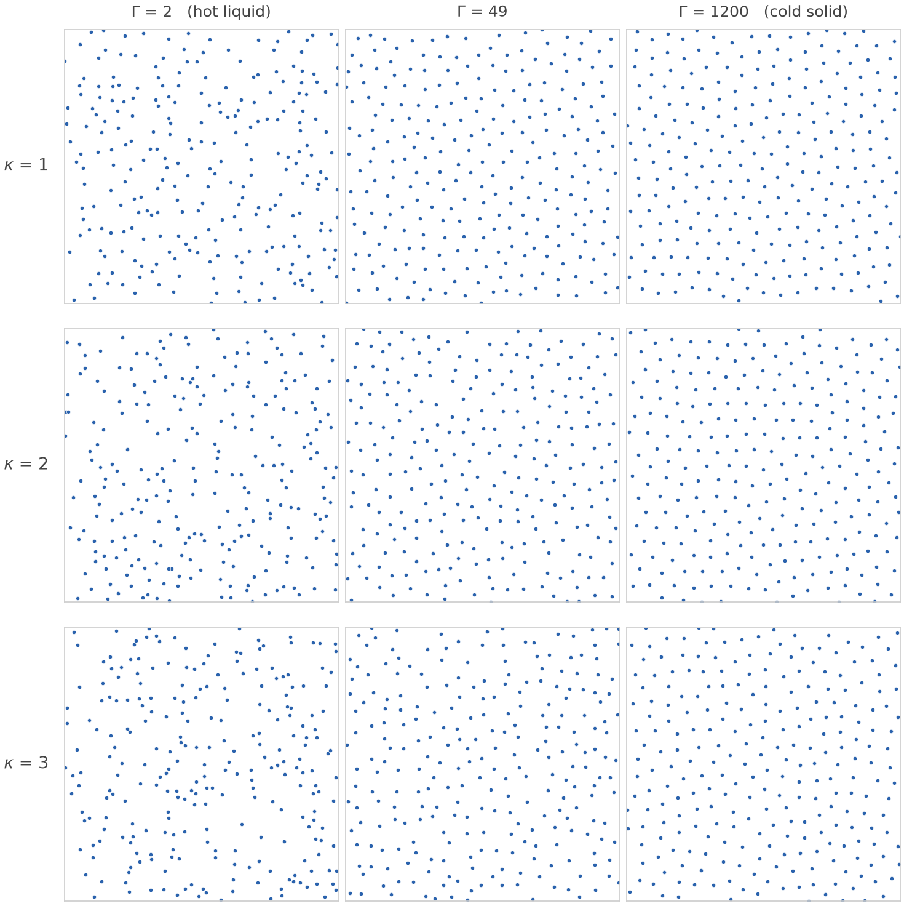
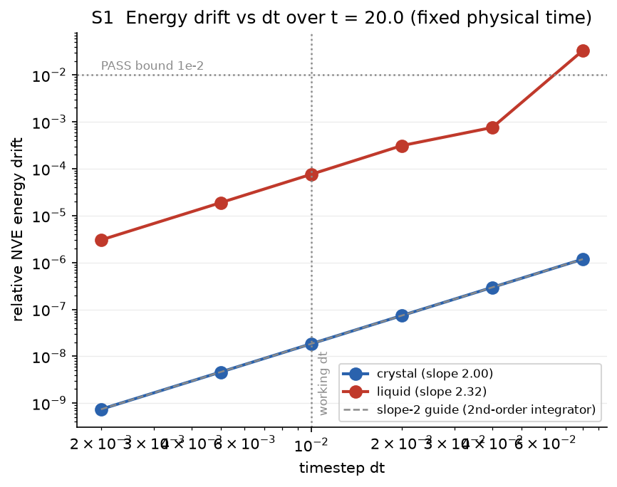
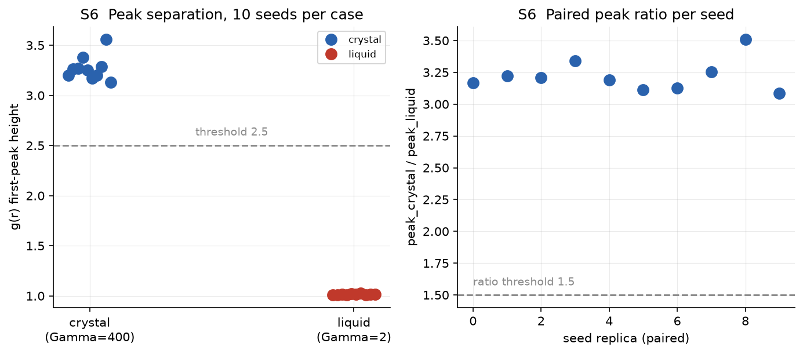

<div align="center">

# YDP-MD Engine

### A 2D Yukawa dusty-plasma molecular-dynamics simulator

<br>



*Figure: A visual phase diagram, straight out of the simulator. Coupling Γ increases left → right (hot → cold), screening κ increases top → bottom. Watch the hot liquid freeze into a triangular crystal — and look closely at the bottom-right panel: at κ = 3 the melting line has climbed to Γ_m ≈ 1100, so Γ = 1200 is only barely solid and full of defects. The physics is in the pictures.*

</div>

---

## What is this?

A self-contained classical molecular-dynamics engine for **2D dusty plasmas**: N charged dust grains interacting through a Yukawa potential in a periodic box, using a Langevin thermostat.

> *"This single file is meant to be READ as much as RUN."* — `sim.py`, line 1

It exists to **Generate ML datasets**. `run.py` sweeps the (Γ, κ) phase plane and writes thousands of labelled, statistically independent particle configurations — the training data for neural networks that learn to *read* plasma state parameters off a snapshot.

I try to prove every claim and parameter I have made in this codebase. There is a 5-gate validation ladder (`test.py`) that must pass before the generator will even run, and every threshold and variable behind those gates was **empirically calibrated** with standard methods (`heuristics.py` + `testing_parameters.txt`).

## The physics 

Dust grains in a plasma acquire large negative charges. The surrounding electrons and ions screen their Coulomb repulsion, leaving the **Yukawa pair potential**

$$U(r) = \frac{e^{-\kappa r}}{r}$$

in reduced units (mass, Wigner–Seitz radius, energy scale and k_B all = 1). The density is pinned by the units: the box side is L = √(Nπ). Two dimensionless knobs then define a state point:

| Variable | Meaning | Effect |
|---|---|---|
| **Γ** (coupling) | interaction energy / thermal energy, sets T = 1/Γ | ↑ Γ → colder → **triangular crystal** |
| **κ** (screening) | inter-particle spacing / Debye length | ↑ κ → shorter-ranged forces → **harder to freeze** |

The thermostat is **Langevin (OBABO splitting)** — physically motivated for dusty plasma, since real grains feel neutral-gas drag and random collisional kicks. Setting friction = 0 collapses it *exactly* to energy-conserving velocity-Verlet, so one integrator serves both the thermostatted (NVT) and conservative (NVE) runs.

## The validation ladder

`run.py` **refuses to generate data** until every gate in `test.py` passes. The five gates, with currently measured values:

| # | Gate | Criterion | Measured | Status |
|---|---|---|---|---|
| 1 | Newton's 3rd law | \|ΣF\| < 10⁻¹⁰ | ~2.5 × 10⁻¹⁴ | PASS |
| 2 | NVE energy conservation | rel. drift < 10⁻² | 9.2 × 10⁻⁵ | PASS |
| 3 | Thermostat convergence | \|T̄ − T_target\| < 5% | +1.6% | PASS |
| 4 | g(r) normalization (ideal gas) | \|ḡ − 1\| < 0.05 | 0.005 | PASS |
| 5 | g(r) structure (crystal vs liquid) | peak > 2.5 and > 1.5× liquid | 3.30 vs 1.01 | PASS |

None of the thresholds above are guesses. Each one was pinned by a **calibration study** (`heuristics.py`, ~50 full simulations, fixed seeds, fully reproducible via `python3 heuristics.py --all`) using only standard, citable methods:

| Sweep | Standard method | What it pinned |
|---|---|---|
| S1 timestep | NVE drift vs dt on log-log (must scale as dt²) | dt = 0.01 with 131× headroom below the drift bound |
| S2 equilibration | settling time of T(t) and U(t), 8 seeds | averaging cutoff (2000 steps), run length (6000) |
| S3 decorrelation | velocity & energy autocorrelation, integrated τ | frame-sampling interval, honestly reframed (see below) |
| S4 g(r) resolution | convergence ("knee") study, like mesh refinement | frames = 50, bins = 80 (bins < 60 under-resolves) |
| S5 noise floors | 10 seed replicas + Flyvbjerg–Petersen blocking | the 5% and 0.05 tolerances (4.4× and 70× above noise) |
| S6 peak separation | 10-seed distributions of crystal/liquid peaks | thresholds sit inside a gap ~17σ wide — no overlap |
| S7 bin skipping | per-bin Poisson noise + verdict sensitivity | skip = 5 small-r bins (verdict flat over skip 0–12) |
| S8 friction invariance | equilibrium observables vs Langevin friction | friction = 1.0 (usable window [0.5, 2]) |

<p align="center">


</p>

The calibration even **caught two of the suite's own assumptions being wrong**: the original 1000-step averaging cutoff started inside the cooling transient (fixed → 2000), and the frame-sampling interval turned out not to give independent frames (reframed as thinning; independence comes from seed replicas instead). A validation suite that can catch its own assumptions is one you can trust. Full report with every number: [`testing_parameters.txt`](testing_parameters.txt) · raw evidence: [`heuristics_out/`](heuristics_out/).

## Install & run

```bash
git clone https://github.com/KushmanG/Yukawa-Dusty-Plasma-Molecular-Dynamics-Engine.git
cd Yukawa-Dusty-Plasma-Molecular-Dynamics-Engine
python3 -m venv md && source md/bin/activate
pip install -r requirements.txt
```

```bash
python3 test.py                # run the 5-gate validation ladder (~1 min)
python3 run.py --pilot         # 27-sample pilot dataset (~4 min)
python3 run.py                 # full 1400-sample dataset (~3 h — walk away)
python3 heuristics.py --all    # reproduce the entire calibration study
```

| `run.py` flag | What it does | When to use it |
|---|---|---|
| *(none)* | validates, then generates the full grid | the real dataset run |
| `--pilot` | tiny 3 × 3 × 3 grid → 27 samples | first contact, pipeline sanity check |
| `--skip-validation` | bypasses the `test.py` gate | development iteration **only** — never for a real dataset |

Timings are single-core on an Apple-silicon laptop (~8 s per sample). The Γ/κ/seed grid lives in one clearly-marked block near the top of `run.py` — edit it there to customize ranges.

## The dataset

```
data/
├── manifest.csv                # sample_id, gamma, kappa, seed — the split/index file
├── sample_0000/
│   ├── positions.npy           # (256, 2) float64 particle coordinates — the ground truth
│   ├── metadata.npy            # [Γ, κ, N] — the label (box side follows: L = √(Nπ))
│   └── snapshot.png            # human preview only, not a model input
├── sample_0001/
└── ...
```

| Consumer | Input | How |
|---|---|---|
| **CNN** | rasterized image | `positions.npy` → 2D histogram / density render (rasterizer lives in the CNN repo) |
| **GNN** | raw coordinates | `positions.npy` → graph (neighbours under periodic boundaries, L = √(Nπ)) |

**Grid:** Γ log-spaced 2 → 1200 (10 values) × κ linear 1 → 3 (7 values) × **20 independent seeds** per pair = **1400 samples**.

Design choices, justified:

- **Seeds are the third axis.** Twenty seeds per (Γ, κ) means a model sees the *statistical* arrangement a label produces, not one lucky frame — the difference between learning the physics and memorizing fingerprints.
- **One frame per run, the final one.** Calibration sweep S3 measured frames within a run to be strongly correlated, so multi-frame "samples" would be near-duplicates. Every sample here is the end state of its own independently-seeded, fully equilibrated 6000-step run.
- **Reproducible by construction.** The global sample counter *is* the RNG seed: rerunning `run.py` regenerates the identical dataset, and no two samples share a random stream.
- **No dead corners.** Γ crosses the melting line at every κ in the grid (Γ_m ≈ 178 at κ = 1 rising to ≈ 1100 at κ = 3), so both phases — and the near-melt boundary — are represented across the whole plane.

A 27-sample pilot is committed at [`sample_dataset/`](sample_dataset/) as a format reference. The full `data/` directory is gitignored — regenerate it anytime with `python3 run.py`.

## Repo map

| File | Role |
|---|---|
| [`sim.py`](sim.py) | the physics toolbox — positions, velocities, forces, energy, integrator, thermostat, g(r); tutorial-grade comments |
| [`test.py`](test.py) | the 5-gate validation ladder; exposes `run_validation() -> bool` |
| [`run.py`](run.py) | the dataset generator (gated on validation) |
| [`heuristics.py`](heuristics.py) | the calibration study — 8 standard-method sweeps that justify every knob |
| [`testing_parameters.txt`](testing_parameters.txt) | the calibration report: every parameter, its method, its measured numbers |
| [`heuristics_out/`](heuristics_out/) | raw calibration evidence (JSON + figures) |
| [`sample_dataset/`](sample_dataset/) | committed 27-sample pilot dataset |
| [`imports.py`](imports.py) / [`requirements.txt`](requirements.txt) | dependencies (NumPy, Matplotlib — the physics itself is pure NumPy) |

## Roadmap

- [x] Physics engine + Langevin thermostat
- [x] Validation ladder, empirically calibrated (v4–v5)
- [x] Dataset generator + pilot dataset (v6 — *you are here*)
- [ ] **CNN** — regress (Γ, κ) from rasterized snapshots
- [ ] **GNN** — regress (Γ, κ) directly from particle coordinates
- [ ] Melting-line check — ψ₆ bond-orientational order vs the published Hartmann–Donkó Γ_m(κ) curve
- [ ] Research article

> **Stay tuned:** the CNN and GNN are coming as a **separate repo on this account** ([@KushmanG](https://github.com/KushmanG)) — this engine is the data factory, the networks get their own home. Link will land here when it's up.

## References

1. P. Hartmann, G. J. Kalman, Z. Donkó, K. Kutasi, *Equilibrium properties and phase diagram of two-dimensional Yukawa systems*, *Phys. Rev. E* **72**, 026409 (2005) — the 2D Yukawa melting line.
2. M. P. Allen & D. J. Tildesley, *Computer Simulation of Liquids*, Oxford University Press — timestep and g(r) methodology.
3. D. Frenkel & B. Smit, *Understanding Molecular Simulation*, Academic Press — MD validation practice.
4. H. Flyvbjerg & H. G. Petersen, *Error estimates on averages of correlated data*, *J. Chem. Phys.* **91**, 461 (1989) — block averaging.
5. A. Sokal, *Monte Carlo Methods in Statistical Mechanics* (lecture notes) — autocorrelation-time analysis.

## License

[MIT](LICENSE) — use it, fork it, cite it if it helps your work.

---

<div align="center">

Maintained by [**@KushmanG**](https://github.com/KushmanG) · the git history (v1 → v6) is the build log — each commit message documents a stage of the climb.

</div>
